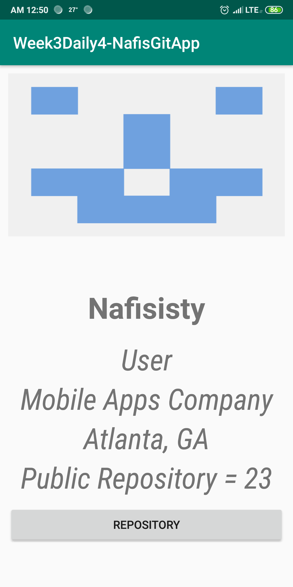
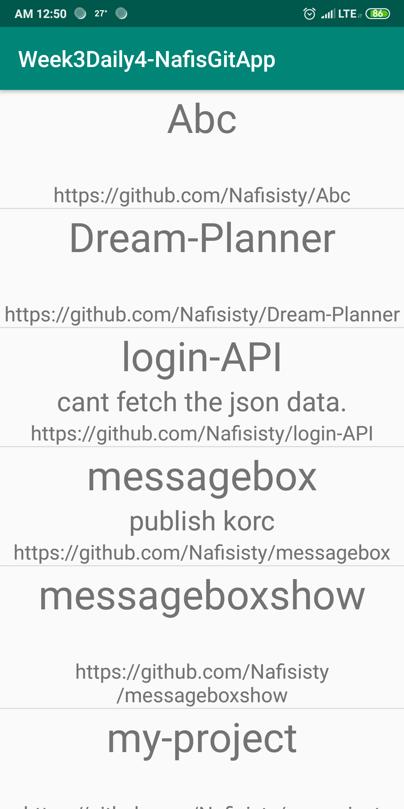

# Week3Daily4NafisGitApp
Create an application with two screen. Screen one: should have your Github profile. Use at least 4 fields from the response to update the views. Screen 2 Populate the recyclerView with the repositories you get from your profile. Use at least 3 fields in each item view.

Screen 1: User Profile View

Screen 2: User's repositories

